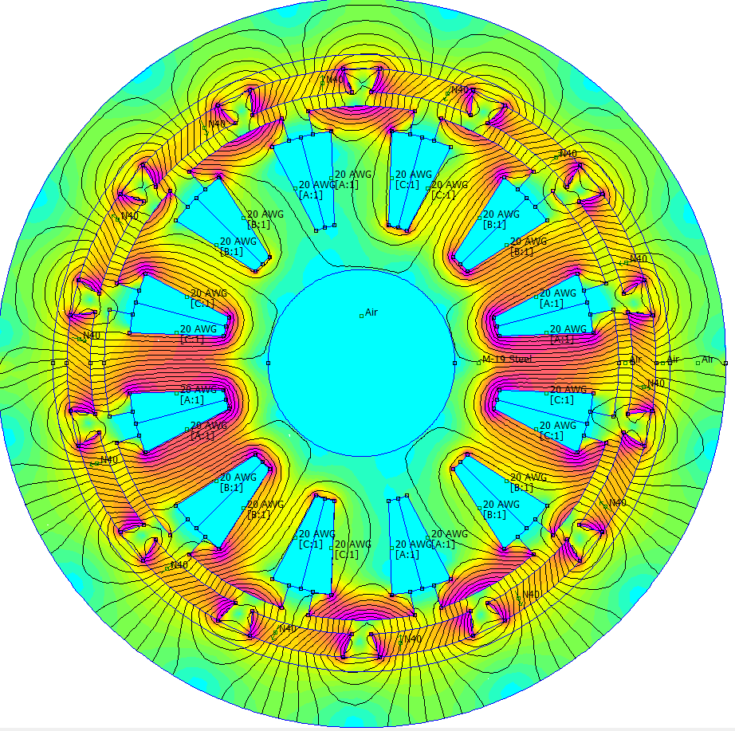

# Silnik elektryczny w FEMM 4.2 - Wariant: magnesy NdFeB 40 MGOe + uzwojenia

  

## Uruchomienie

W programie FEMM 4.2: **File → Open Lua Script**, a następnie wybierz plik zależnie od tego, co chcesz uzyskać:

- **sam model (geometria):** `skrypt_do_narysowania.lua`
- **model + obliczenia (zapisuje `wyniki.csv` obok skryptu):** `skrypt_rysunek_i_obliczenia.lua`
